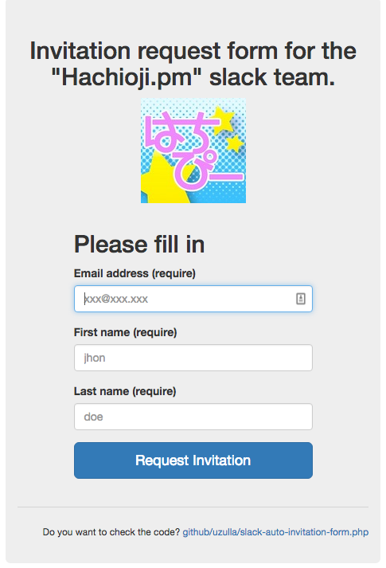

# Slack invitation request form.

## sample screen shot



# setup

```
$ git clone https://github.com/uzulla/slack-auto-invitation-form.php.git
$ cd slack-auto-invitation-form.php
$ composer install
$ cp config.sample.php config.php
$ vi config.php
$ php -S 127.0.0.1:8080 -t public # or as you like
```

# build docker image and run

```
$ composer install
$ docker build -f docker/Dockerfile -t you/fill_me:latest .
$ docker run -e TEAM_SUB_DOMAIN=fill_me -e SLACK_API_TOKEN=xoxp-fill_me -p 8080:80 you/fill_me:latest
```

# deploy to GAE

```
$ vi app.yaml

# test
$ /usr/local/bin/dev_appserver.py .

# deploy
$ /usr/local/bin/appcfg.py -V v1 update ./
```

# deploy to heroku

```
$ cp config.docker.php config.php
$ composer update
$ git add -f config.php
$ git add composer.lock
$ git commit

# create an app if you don't have
$ heroku apps:create app-name
$ heroku buildpacks:set heroku/php

# set config vars
$ heroku config:set TEAM_SUB_DOMAIN=fill_me
$ heroku config:set SLACK_API_TOKEN=xoxp-fill_me

# deploy
$ git push heroku master
```
